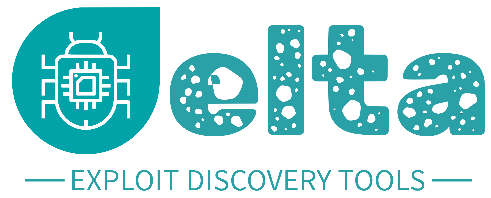

  

    
    
    

## 📜 Description

**Delta** is an **Exploit Discovery Tool** designed to search for vulnerabilities based on CVE (Common Vulnerabilities and Exposures) or CWE (Common Weakness Enumeration). Delta is intended for use in security assessments and vulnerability discovery.

### Key Features:

- **CVE/CWE Search**: Allows users to perform searches for vulnerabilities based on CVE identifiers or CWE types.
- **Broad Vulnerability Search**: Allows users to search for vulnerabilities across a wide range of software, technologies, and systems beyond CVE and CWE, including server technologies (e.g., Apache, Nginx), desktop applications, network devices, and more.
- **Software and Technology Search**: Enables users to perform searches based on specific software, technologies, or systems, such as databases, content management systems (CMS), development frameworks, and more.
- **Customizable Queries**: Enables users to specify search terms and parameters for tailored vulnerability discovery.
- **Detailed Results**: Provides comprehensive details about discovered vulnerabilities, including descriptions and associated data.
- **User-Friendly CLI**: Provides a command-line interface that formats query results in a clear and easily readable manner, improving the readability and accessibility of vulnerability information.

### Learning Objectives:

- **Understanding Vulnerability Discovery**: Learn about the role of CVE and CWE in identifying and understanding software vulnerabilities.
- **Python Programming**: Enhance skills in Python programming, particularly in making API requests and handling JSON data.
- **Application Development**: Understand techniques for developing CLI tools, with a focus on querying and reporting vulnerabilities.

**Note**: Delta is designed for educational and testing purposes. Ensure to use this application in a responsible and legal manner, following relevant cybersecurity guidelines and ethics.

## 🛠️ Reference Tools

- **[SploitScan](https://github.com/xaitax/SploitScan/)** - A powerful vulnerability and exploit discovery tool focusing on scanning and finding vulnerabilities efficiently.

## 📚 Reference Data

- **[Nuclei](https://nuclei.projectdiscovery.io)** - A fast and customizable vulnerability scanner based on templates.
- **[ExploitDB](https://www.exploit-db.com)** - A database of exploits and vulnerable software for security researchers and penetration testers.
- **[PoC-in-GitHub](https://github.com/nomi-sec/PoC-in-GitHub)** - A repository that contains proof-of-concept exploits and vulnerabilities.
- **[HackerOne](https://hackerone.com)** - A platform for bug bounty programs and vulnerability reporting.
- **[CISA](https://www.cisa.gov)** - U.S. Cybersecurity and Infrastructure Security Agency, providing cybersecurity alerts and tools.
- **[CVE List](https://github.com/CVEProject/cvelistV5)** - GitHub repository of CVEs (Common Vulnerabilities and Exposures) maintained by the CVE Program.
- **[API First](https://api.first.org)** - API providing real-time threat intelligence, security data, and vulnerability information.
- **[Metasploit](https://www.metasploit.com)** - A powerful open-source penetration testing framework for developing and executing exploit code against remote targets.

## Demo App

